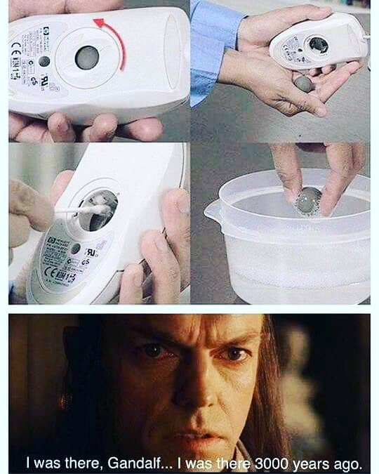

# Breve storia dei calcolatori (parte 1)

Un computer (o calcolatore) è una macchina automatizzata programmabile
in grado di eseguire sia complessi calcoli matematici che altri tipi
di elaborazioni dati.

Il computer è un dispositivo elettronico digitale, programmabile a
scopo generico, basato sul modello teorico-computazionale della
[macchina di Turing](https://it.wikipedia.org/wiki/Macchina_di_Turing)
e sull'[architettura di von
Neumann](https://it.wikipedia.org/wiki/Architettura_di_von_Neumann).


## Dai primi computer al microprocessore

Nel corso della storia, l'implementazione tecnologica del computer si
è modificata profondamente sia nei meccanismi di funzionamento
(meccanici, elettromeccanici ed elettronici), sia nelle modalità di
rappresentazione dell'informazione (analogica e digitale) sia in altre
caratteristiche (architettura interna, programmabilità, ecc.).

### Atanasoff-Berry Computer

L'[Atanasoff-Berry
Computer](https://it.wikipedia.org/wiki/Atanasoff-Berry_Computer),
spesso chiamato ABC, è stato il primo computer digitale totalmente
elettronico; rappresenta uno dei maggiori passi avanti della storia
dei calcolatori.

Non era Turing-completo a differenza dei suoi successori come l'ENIAC
o l'EDVAC costruito dalla University of Manchester o le macchine
progettate da Alan Turing dopo la seconda guerra mondiale al National
Physical Laboratory. La macchina non implementava un'architettura per
memorizzare i programmi, un'architettura che rende i computer attuali
così versatili.

### Colossus Mark I/II

Il [Colossus](https://it.wikipedia.org/wiki/Colossus) è stato uno dei
primi computer elettronici programmabili nella storia
dell'informatica. Costruito e messo in opera nel Regno Unito, durante
la seconda guerra mondiale, fu in grado di decifrare i codici
sviluppati dalla cifratrice Lorenz SZ 40/42 usata dai nazisti per
proteggere la corrispondenza fra Adolf Hitler e i suoi capi di stato
maggiore, oltre che alle comunicazioni Purple e Red giapponesi, basate
sulla tecnologia di Enigma. I servizi segreti britannici fecero di
tutto per interpretare i codici dei nazisti, che però venivano
cambiati quotidianamente.

### ENIAC

L'Electronic numerical integrator and computer
([ENIAC](https://it.wikipedia.org/wiki/ENIAC)) è, tra quelli di cui si
ha notizia, il quarto computer elettronico digitale della
storia. Progettato e costruito alla Moore School of Electrical Engineering,
una ex scuola universitaria dell'Università della Pennsylvania, per il
Ballistic Research Laboratory, un ex centro di ricerca dell'esercito
degli Stati Uniti d'America, fu presentato ufficialmente il 16
febbraio 1946 e progettato da J. Presper Eckert e John Mauchly (il
team di sviluppo includeva Bob Shaw (tabelle funzionali), Chuan Chu
(divisione/radice quadrata), Kite Sharpless (programmatore
principale), Arthur Burks (moltiplicatore), Harry Huskey
(lettore/stampante) e Jack Davis (accumulatori)).

```{warning}
Per far funzionare l’ENIAC era necessaria un’intera centrale elettrica!!! 
```

### Transistor

Il [transistor](https://it.wikipedia.org/wiki/Transistor) è un
dispositivo a semiconduttore usato per amplificare o interrompere
l'alimentazione dei segnali elettrici ed è uno dei componenti
fondamentali dell'elettronica moderna.

Il dispositivo, consentendo di realizzare circuiti che non
richiedevano le elevate tensioni anodiche delle valvole termoioniche,
permise la miniaturizzazione dei dispositivi elettronici portatili
alimentati a pile.


### Olivetti Elea 9003

[Elea 9003] (https://it.wikipedia.org/wiki/Olivetti_Elea_9003)
(Macchina 1T) è uno dei modelli di calcolatori mainframe ad
altissime prestazioni sviluppati dall'Olivetti facenti parte della
famiglia Olivetti Elea. Si tratta del primo computer a _transistor_
commerciale prodotto in Italia e uno dei primi completamente
transistorizzati del mondo. Fu concepito, progettato e sviluppato
tra il 1957 e il 1959 da un piccolo gruppo di giovani ricercatori
guidati da Mario Tchou.

L'acronimo ELEA sta per ELaboratore Elettronico Aritmetico
(successivamente modificato in Automatico per ragioni di mercato) e fu
scelto come omaggio alla polis di Elea, colonia della Magna Grecia,
sede della scuola eleatica di filosofia.

### IBM 1400

La serie 1400 dell'IBM appartiene alla cosiddetta seconda generazione
di computer che utilizzava circuiti a transistor e che all'incirca
comprende la produzione di computer tra la fine degli anni '50 e gli
anni '60. L'IBM 1401, il primo della serie 1400, è il prodotto che ha
dato inizio alla posizione predominante dell'IBM sul mercato mondiale:
annunciato nel 1959 e rimasto in commercio fino al 1971. Ebbe un
grande successo commerciale tanto da superare, nei suoi vari modelli,
le 20.000 unità vendute.

### PDP-8

Il PDP-8 (Programmed Data Processor-8) è stato il primo minicomputer
commerciale della storia ad aver ottenuto successo commerciale. È
stato prodotto dalla Digital Equipment Corporation (DEC) negli anni
sessanta e fu il più venduto computer della serie PDP. Costava
all'epoca 16000 dollari.

Il PDP-8 è stato un computer storicamente importante per i suoi
progressi tecnologici, per l'I/O, per sviluppo software, e per la
progettazione di sistemi operativi.

Il primo modello di PDP-8 (chiamato "Straight-8") aveva una tecnologia
"discreta" (cioè, senza uso di microprocessori) a transistor e con una
dimensione simile a quella di un frigorifero. In seguito fu sostituito
dal PDP-8/S, più piccolo, meno caro, ma molto più lento rispetto al
primo PDP-8.

### Olivetti Programma 101

La [Olivetti Programma
101](https://it.wikipedia.org/wiki/Olivetti_Programma_101) (sigla
P101) è un calcolatore da tavolo programmabile ritenuta il primo
personal computer della storia.

Venne sviluppata dalla ditta italiana Olivetti negli anni tra il 1962
e il 1964 e prodotta tra il 1965 e il 1971. Presentata per la prima
volta alla grande esposizione di prodotti per ufficio BEMA di New York
nell'ottobre 1965, fu progettata da un gruppo di ricerca guidato
dall'ingegnere Pier Giorgio Perotto, in omaggio al quale assunse il
soprannome di Perottina in assonanza con la pascalina, celebre
macchina da calcolo inventata nel 1642 dallo scienziato francese
Blaise Pascal; il gruppo, oltre a Perotto stesso, comprendeva anche
Giovanni De Sandre, Gastone Garziera, Giancarlo Toppi e Giuliano
Gaiti. Il designer Mario Bellini le conferì un disegno
avveniristico per l'epoca.

[Guarda l'intervista a Pier Giorgio Perotto](https://www.youtube.com/watch?v=ZTDmerqIsJs)

[Guarda il documentario sulla P101](https://www.youtube.com/watch?v=UWFZLgEiP0M)


## Floppy Disk

Il [floppy disk](https://it.wikipedia.org/wiki/Floppy_disk) (chiamato
anche dischetto o floppy) è un supporto di memoria digitale di tipo
magnetico inventato dalla IBM nel 1967, molto diffuso tra la fine
degli anni settanta e gli anni novanta. Essendo stato per decenni il
dispositivo di memorizzazione esterna più usato, l'immagine del floppy
disk venne impiegata nell'interfaccia grafica di programmi e siti web
per simboleggiare il comando per il salvataggio dei dati e questa
funzione rimase anche quando il loro impiego come supporto fisico
divenne obsoleto.


<br></br>

## Mouse

Il [mouse](https://it.wikipedia.org/wiki/Mouse) è un dispositivo di
puntamento portatile che traduce il movimento bidimensionale rispetto
ad una superficie piana nel movimento di un cursore su uno schermo,
permettendo un controllo fluido dell'interfaccia grafica di un
computer. I mouse dispongono anche di uno o più pulsanti per
consentire varie operazioni e ai quali possono essere assegnate varie
funzioni di input. Spesso dispongono anche di altri elementi, come per
esempio la rotellina che consente la funzione di scorrimento
verticale.

L'etimologia del nome deriva dal vocabolo che in lingua inglese indica
topo, per via della somiglianza con l'animale. Il dispositivo è stato
brevettato nel 1967 e l'uso si è diffuso nella maggior parte dei
personal computer del mondo.



<br></br>

## Microprocessore

Descrivere la storia dell'informatica e la nascita del microprocessore
richiederebbero conoscenze che sono al di là di quelle dell'autore di
queste brevi note e soprattutto renderebbero queste brevi note
qualcosa di più simile ad una enciclopedia.

Le pagine dedicate al microprocessore su
[Wikipedia](https://it.wikipedia.org/wiki/Microprocessore) e sul sito
dell'[IBM](https://www.ibm.com/it-it/think/topics/microprocessor) sono
degli ottimi punti di partenza per rispondere alle tue curiosità.

In breve, il microprocessore è un circuito elettronico dedicato
all'elaborazione di istruzioni, costituito da uno o più circuiti
integrati di dimensioni molto ridotte.

Il primo microprocessore commerciale fu l'[Intel
4004](https://it.wikipedia.org/wiki/Intel_4004), lanciato a Novembre
del 1971, sviluppato dall'italiano [Federico
Faggin](https://it.wikipedia.org/wiki/Federico_Faggin) (che ha anche
sviluppato i primi _touchpad_ e _touch screen_) il microprocessore ha
letteralmente rivoluzionato il mondo, rendendo possibile la nascita
del personal computer.

