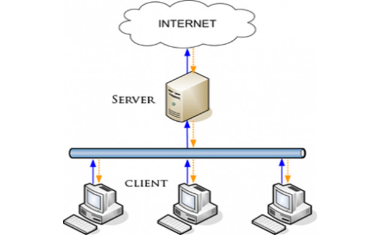
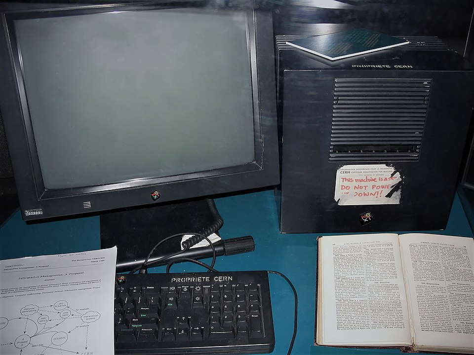
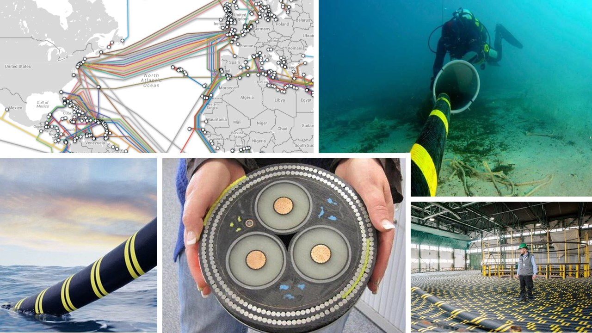

# Internet e il Web

Sebbene siano molto spessi utilizzati come sinonimi,
[Internet](https://it.wikipedia.org/wiki/Internet) e il
[Web](https://it.wikipedia.org/wiki/World_Wide_Web) sono due concetti
diversi.

Sintetizzando e semplificando, si può dire che Internet è una
determinata rete di computer quindi è una struttura fisica. Invece, il
Web rappresenta uno specifico servizio (uno dei tanti impiegabili
tramite Internet) e, precisamente, è il servizio rappresentato da
contenuti e informazioni fruibili mediante un browser su indirizzo
http o applicazioni web. Il Web si appoggia a Internet.

## Internet

Senza entrare in troppi dettagli tecnici, Internet è una grande rete
globale di computer, una infrastruttura fisica, che permette a
dispositivi in tutto il mondo di scambiarsi informazioni.

Le componenti fondamentali di Internet sono:

- *Nodi*. Sono i punti della rete: computer, smartphone, router, server. Ogni nodo può inviare o ricevere dati.

- *Server*. Sono computer potenti che memorizzano e forniscono informazioni: siti web, video, email, file. Quando visiti un sito, ti stai collegando a un server.

- *Cavi e collegamenti*. I nodi sono collegati tra loro tramite cavi fisici (come i cavi in fibra ottica che attraversano continenti e oceani) o connessioni wireless (Wi-Fi, 4G/5G). Questi collegamenti permettono ai dati di viaggiare sotto forma di segnali.

- *Pacchetti di dati*. Le informazioni non viaggiano tutte insieme: vengono divise in piccoli pacchetti che attraversano la rete seguendo percorsi diversi e si ricompongono all’arrivo.

* *Protocollo*. Per capirsi, tutti i dispositivi usano regole comuni chiamate protocolli (come TCP/IP). È un po’ come una grammatica che rende possibile la comunicazione.

Riassumendo: Internet è una rete di reti, fatta di nodi collegati tra loro, che si scambiano dati tramite cavi e segnali usando un linguaggio condiviso.

  

## World Wide Web (Web)

Il World Wide Web (Web) è uno dei servizi che usa Internet.
È l'insieme di pagine e siti web che possiamo visitare tramite un browser (Chrome, Firefox, Safari, etc.).

Le componenti fondamentali del Web sono:

- *Pagine web*. Sono documenti digitali fatti di testo, immagini, video, link. Vivono sui server e vengono mostrati dal browser.

- *Siti web*. Sono gruppi di pagine web collegate tra loro e accessibili attraverso un indirizzo (URL).

- *Browser*. È il programma che ci permette di esplorare il Web. Riceve le pagine dai server e le mostra sullo schermo.

- *URL (indirizzo)*. È come l’indirizzo di casa di una pagina: serve per dire al browser dove trovarla.

- *HTTP/HTTPS*. Sono i protocolli che regolano la comunicazione tra
browser e server.  HTTPS è la versione sicura, che protegge i dati.

Riassumendo: Internet è l’infrastruttura, mentre il Web è un servizio che _usa_ l'Internet per farci navigare tra pagine e siti.

Nell'immagina la NeXT workstation (NeXTcube e monitor) usata da Tim Berners-Lee al CERN come primo server Web del World Wide Web.

  

## Cavi

Gran parte del traffico mondiale viaggia attraverso cavi fisici,
soprattutto cavi in fibra ottica che attraversano continenti e
oceani. Anche se usiamo Wi-Fi o 4G/5G per collegarci, questi segnali
arrivano a una stazione e poi finiscono comunque nei cavi che formano
la _spina dorsale_ della rete.

La componente principale di Internet sono proprio i cavi: tanti
lunghissimi cavi. L'infrastruttura fisica di Internet è davvero estesa
e comprende [cavi sottomarini](https://www.submarinecablemap.com/) e
terrestri.  Su terra abbiamo decine di milioni di chilometri di fibra,
e sotto i mari abbiamo oltre un milione di km di cavi.

  

