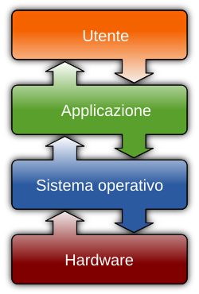

# Sistema Operativo

La storia dei sistemi operativi descrive l'evoluzione durante tutto il
periodo di sviluppo dei computer o calcolatori elettronici. Essa si
sviluppa parallela a fianco della storia del computer e, più in
generale, della storia dell'informatica. In un periodo delimitabile
tra il 1945 e il 1955 gli elaboratori elettronici erano ammassi di
valvole termoioniche, occupavano intere stanze, erano lentissimi e
così costosi che potevano permetterseli soltanto grossi centri di
calcolo o Università o organizzazioni dotate finanziariamente.

A partire dagli anni '60 con lo sviluppo dei primi mainframe si
resero necessari software per l'utilizzo che consentissero
l'interfacciamento degli utenti con tali macchine, l'evoluzione si
accelerò a partire dagli anni '70, soprattutto con l'avvento degli
home computer e dei personal computer.

Un sistema operativo è un insieme di software che fornisce all'utente
una serie di comandi e servizi per usufruire al meglio della potenza
di calcolo di un qualsivoglia elaboratore elettronico, spaziando dal
più piccolo dei palmari al più potente tra i mainframe.

In particolare, nasconde tutti i dettagli tecnici legati allo
specifico hardware e architettura rappresentando le informazioni ad un
alto livello, meglio comprensibile dall'uomo.

Esso garantisce l'operatività di base di un calcolatore, coordinando e
gestendo le risorse hardware di processamento (processore) e
memorizzazione (memoria primaria), le periferiche, le risorse/attività
software (processi) e facendo da interfaccia con l'utente, senza il
quale quindi non sarebbe possibile l'utilizzo del computer stesso e
dei programmi/software specifici, come applicazioni o librerie
software.

  

È dunque un componente essenziale del sistema di elaborazione che
funge da interfaccia tra l'utente e la macchina ed inoltre è una base
alla quale si appoggiano gli altri software, che dunque dovranno
essere progettati e realizzati in modo da essere riconosciuti e
supportati da quel particolare sistema operativo. Assieme al
processore, con cui spesso è strettamente legato, costituisce la
cosiddetta piattaforma del sistema di elaborazione. In generale un
sistema operativo può essere:

- _monoutente_: se solo utente per volta può accedere alle risorse dell'elaboratore;
- _multiutente_: se più utenti possono accedere alle risorse dell'elaboratore;
- _monotasking_: se in grado di eseguire un solo compito o task (processo) alla volta;
- _multitasking_: se in grado di svolgere più compiti o sottocompiti parallelamente attraverso una certa politica di scheduling (es. timesharing).
- _portabile_: se può funzionare su differenti architetture hardware di processori.

